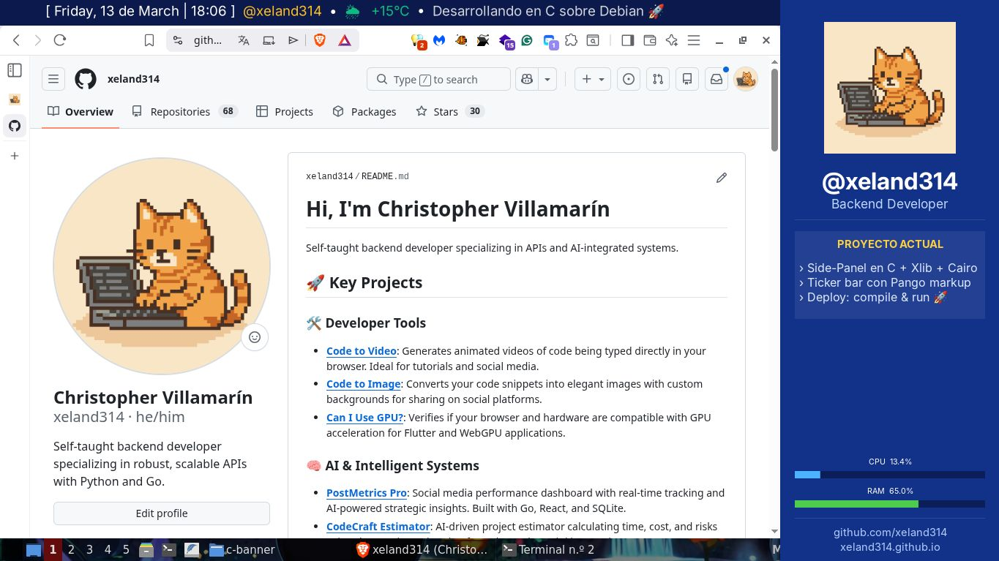

# Side Panel & Ticker (C + X11 + Cairo)



Una solución ligera y minimalista para tener un panel lateral informativo y una barra de noticias (ticker) en Linux, escrita en **C** puro utilizando **Xlib**, **Cairo** y **Pango**.

## ✨ Características

- **Unified Binary**: Tanto la barra superior como el panel lateral se ejecutan en un solo proceso.
- **Compile-to-use**: Sin archivos de configuración externos. Todo se define en el código para máxima velocidad y portabilidad.
- **Async News & Weather**: Hilo dedicado para actualizar el clima (vía `wttr.in`) y rotar mensajes de noticias sin bloquear la UI.
- **EWMH Compliant**: Reserva espacio en el escritorio (struts) para que las ventanas maximizadas no cubran el panel.
- **System Metrics**: Visualización en tiempo real del uso de CPU y RAM.
- **Pango Markup**: Soporte para texto enriquecido y emojis en la barra de noticias.

## 🛠️ Requisitos

Necesitarás las cabeceras de desarrollo de X11, Cairo y Pango:

```bash
# En Debian/Ubuntu
sudo apt install libx11-dev libcairo2-dev libpango1.0-dev libpangocairo-1.0-0
```

## 🚀 Compilación y Uso

Para compilar el proyecto simplemente ejecuta:

```bash
make
```

Esto generará el binario `sidepanel`. Para lanzarlo:

```bash
./sidepanel
```

## 📁 Estructura del Proyecto

- `main.c`: Lógica principal, hilos de actualización y ciclo de renderizado.
- `banner.h`: Definiciones de estructuras y constantes de la UI.
- `logo.png`: Imagen utilizada en la cabecera del panel lateral.
- `Makefile`: Sistema de construcción sencillo y directo.

## ⚙️ Personalización

Al ser un programa *compile-to-use*, para cambiar los mensajes o el nombre del usuario, edita las constantes al principio de `main.c` y vuelve a compilar:

```c
const char* news[] = {
    "Tu mensaje aquí 🚀",
    "Otra noticia... 👨‍💻"
};
```

---
Desarrollado por [xeland314](https://github.com/xeland314)
